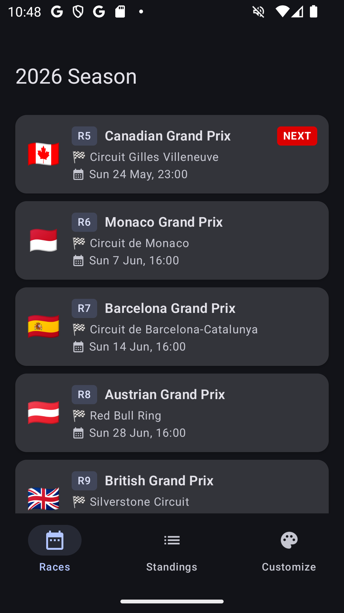
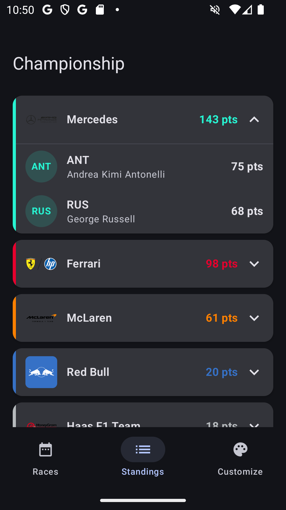

# BeepStop

An F1 companion app for Android. Shows the 2026 race calendar, constructor and driver championship standings, and puts customisable home screen widgets on your launcher.

---

## Screenshots

<p align="center">
  
  &nbsp;&nbsp;&nbsp;
  
</p>

---

## What the app does

| Feature | Description |
|---|---|
| Race calendar | Full 2026 season schedule. Upcoming race is highlighted with a NEXT badge. |
| Standings | Constructor and driver championship tables. Teams are expandable to show their drivers. |
| Widget — Next Race | Home screen widget showing the circuit map and race date. Background and text colors are customisable. |
| Widget — Countdown | Counts down to the next session (race, qualifying, sprint, or practice). Tyre-ring graphic, customisable colors. |
| Widget — Standings | Small and medium variants showing driver or constructor standings at a glance. |
| Customize screen | In-app settings for all widget colors and display modes. Changes persist across reboots and apply to widgets immediately. |

---

## API

**[Jolpi / Ergast F1 API](https://api.jolpi.ca/)** — free, no auth required.

| Endpoint | Used for |
|---|---|
| `GET ergast/f1/2026.json` | Full race calendar with circuit info and session times |
| `GET ergast/f1/current/constructorstandings/` | Current constructor championship standings |
| `GET ergast/f1/current/driverstandings/` | Current driver championship standings |

Data is cached locally with Room. Race schedule refreshes every **6 hours**, standings every **1 hour**. The app and widgets work fully offline using the last cached data.

---

## Tech stack

| Layer | Library |
|---|---|
| UI | Jetpack Compose + Material 3 |
| Navigation | Tab-based (no NavHost) — 3 screens |
| Networking | Retrofit 2 + Gson converter |
| HTTP logging | OkHttp `HttpLoggingInterceptor` (debug only) |
| Local cache | Room 2.8 (KSP) |
| Widget preferences | DataStore Preferences |
| Image loading | Coil Compose |
| Home screen widgets | Glance AppWidget + Glance Material 3 |
| Widget refresh | WorkManager |
| Async | Kotlin Coroutines + Flow |
| Min SDK | API 26 (Android 8.0) |
| Target SDK | API 36 |

---

## Project structure

```
app/src/main/java/com/beepstop/
├── BeepStopApp.kt               # Application class — dependency graph
├── MainActivity.kt              # Single activity, Scaffold + bottom nav
│
├── data/
│   ├── remote/
│   │   ├── ApiModels.kt         # Ergast API DTOs (ApiRace, ApiDriver, …)
│   │   ├── ApiResponse.kt       # JSON response wrappers (MRData, RaceTable, …)
│   │   ├── ApiResult.kt         # Sealed Result type + safeApiCall helper
│   │   ├── ErgastApiService.kt  # Retrofit interface (3 endpoints)
│   │   └── RetrofitClient.kt    # OkHttpClient + Retrofit singleton
│   │
│   ├── local/
│   │   ├── entity/              # Room entities (Race, ConstructorStanding, DriverStanding)
│   │   ├── dao/                 # DAOs (RaceDao, ConstructorDao, DriverDao)
│   │   ├── AppDatabase.kt       # Room database + TTL helpers
│   │   └── PreferencesManager.kt# DataStore wrapper for widget settings
│   │
│   ├── model/                   # Domain models (Race, StandingsTeam, StandingsDriver)
│   ├── mapper/                  # Mapping functions: API → Entity → Domain
│   └── repository/
│       ├── RaceRepository.kt    # Cache-first race data, forceRefresh support
│       └── StandingsRepository.kt
│
├── ui/
│   ├── theme/                   # Material 3 color scheme (F1 red accent, dark/light)
│   ├── components/
│   │   ├── BottomNavBar.kt      # 3-tab nav bar with spring-animated icons
│   │   └── RaceRowItem.kt       # Race card with flag, round badge, NEXT highlight
│   ├── screen/
│   │   ├── RacesScreen.kt       # Race calendar with pull-to-refresh
│   │   ├── StandingsScreen.kt   # Expandable constructor/driver standings
│   │   └── CustomizeScreen.kt   # Widget settings
│   └── viewmodel/
│       ├── RacesViewModel.kt
│       ├── StandingsViewModel.kt
│       └── CustomizeViewModel.kt
│
└── widget/
    └── model/                   # Widget data classes (Circuit, Countdown, Standings)
```

---

## What's done

- [x] Project setup, Gradle dependencies, KSP
- [x] App icon — adaptive, helmet foreground, yellow `#FFD700` background
- [x] Material You theme — F1 red accent, auto light/dark, edge-to-edge
- [x] Release signing — keystore + env-var credentials
- [x] Data models — API DTOs, domain models, widget models, mappers
- [x] Retrofit service — 3 endpoints, 10s/15s timeouts, debug logging
- [x] Room database — 3 tables, cache TTLs (6h races / 1h standings)
- [x] Repository layer — cache-first, stale fallback, `forceRefresh`
- [x] ViewModels — StateFlow, `refresh()`, `toggleTeam()`, DataStore-backed customize
- [x] Bottom navigation — spring-animated 3-tab bar, survives rotation
- [x] Race calendar — flag icons, round badge, NEXT highlight, pull-to-refresh
- [x] Race row component — circuit name, local race time, upcoming filter
- [x] Standings screen — expandable team rows, team color accent, driver codes, pull-to-refresh

