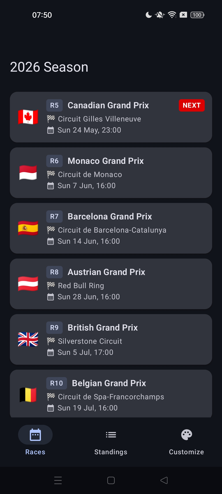
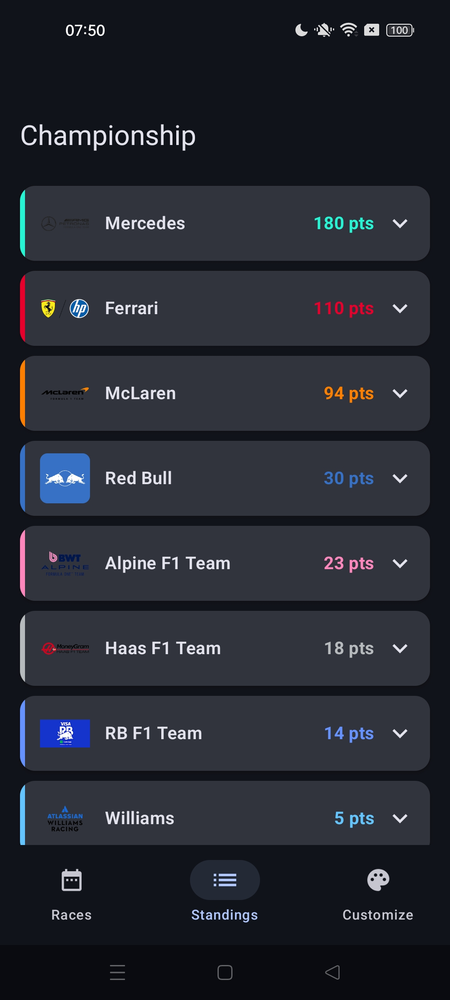
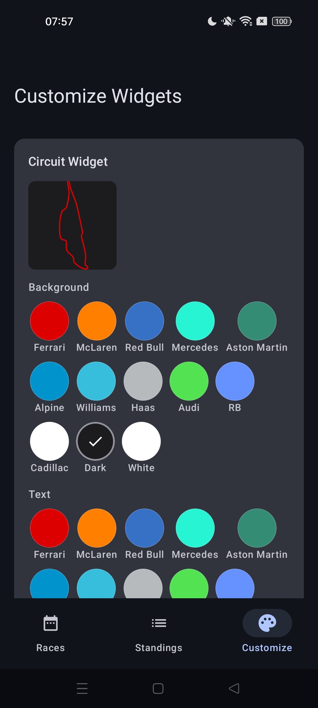
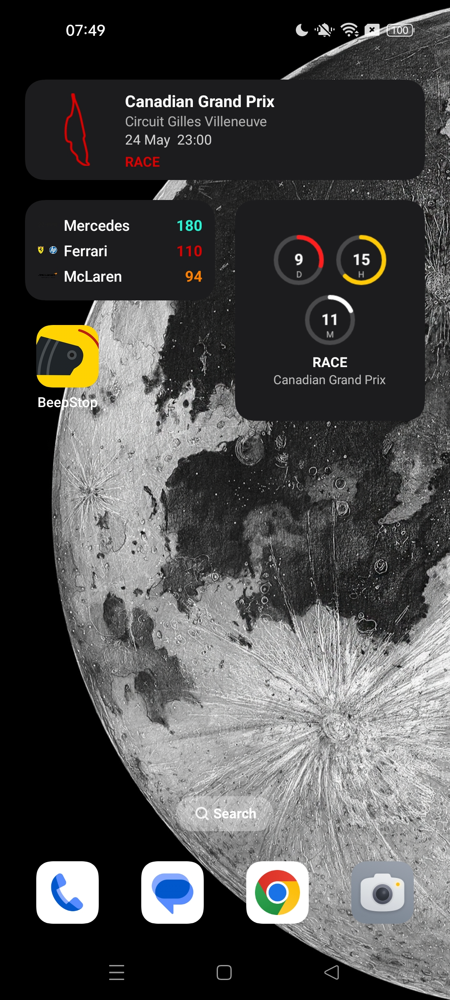
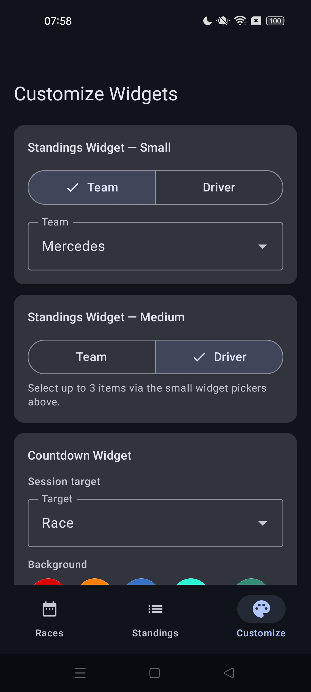
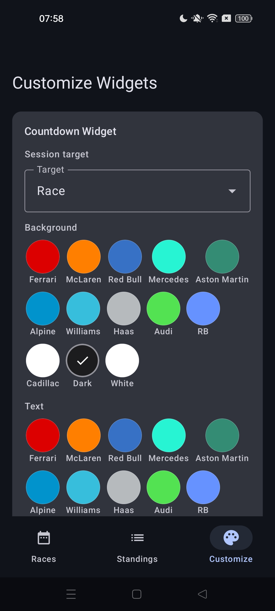

# BeepStop

An F1 companion app for Android. Shows the 2026 race calendar, constructor and driver championship standings, and puts customisable home screen widgets on your launcher.

---

## Screenshots

  
  &nbsp;&nbsp;&nbsp;
  
  &nbsp;&nbsp;&nbsp;
  
  &nbsp;&nbsp;&nbsp;
  

---

## Features

- Full 2026 race calendar with country flags, round badges, and a NEXT badge on the upcoming race. Times are shown in the device's local timezone.
- Constructor and driver championship standings. Each constructor row expands to show its drivers with points and team color accents.
- Three home screen widgets: Next Race, Session Countdown, and Standings.
- Customize screen to pick colors for all widgets and set which session type the countdown targets. Changes apply immediately.
- All data is cached locally with Room and works fully offline. The cache refreshes in the background via WorkManager — races every 6 hours, standings every hour.

---

## Widgets

### Next Race (4 × 1)

A single-row widget that spans the full width of the launcher. Shows the circuit map on the left and race info on the right — race name, circuit name, date and time in the device's local timezone, and a session label (RACE / QUALIFYING / SPRINT / PRACTICE) in the accent color.

The circuit map is rendered from an SVG asset. The track stroke color is rewritten at render time to match the user's chosen circuit line color, so the map always reflects the current Customize settings. Bitmaps are cached in memory after the first render to avoid re-processing on every widget refresh.

### Countdown (2 × 2)

Counts down to the next F1 session using tyre-styled ring graphics. Each ring is drawn with Android Canvas using a rounded stroke, styled after F1 compound colors:

- Red ring (Soft) — days remaining
- Yellow ring (Medium) — hours remaining
- White ring (Hard) — minutes remaining

The layout places Days and Hours on the top row and Minutes centered on the second row, with the session label and race name below. When the session is currently live (within 2 hours of the start time) the widget shows RACE LIVE instead of the countdown.

### Standings (2 × 1)

A compact single-row widget showing the top 3 constructors or drivers with their points, each colored in the team's brand color. Team logos are loaded from a local disk cache written by the background worker.

---

## Customize screen

  
  &nbsp;&nbsp;&nbsp;
  
  &nbsp;&nbsp;&nbsp;
  

The Customize screen is split into three sections, one per widget. All settings are saved to DataStore Preferences and survive reboots.

**Circuit Widget**
Lets you pick three independent colors — background, text, and circuit line. The color picker shows 13 swatches taken directly from the 2026 F1 constructor brand colors (Ferrari, McLaren, Red Bull, Mercedes, Aston Martin, Alpine, Williams, Haas, Audi, RB, Cadillac) plus a dark and a white neutral. A live preview of the circuit map for the next race updates instantly as you tap swatches, so you can see exactly how the widget will look before applying.

**Standings Widget**
A Team / Driver toggle switches between constructor and driver mode. A dropdown then lets you choose which team or driver to feature. The same toggle and picker appear for the medium (3-entry) variant. All 11 constructors and all 22 drivers on the 2026 grid are available.

**Countdown Widget**
A session target dropdown lets you choose which type of session the countdown points to — All (next session of any type), Race, Qualifying, Sprint, or Practice. Background and text color pickers work the same as the circuit widget. Tapping Apply saves everything, triggers a widget refresh, and shows a brief green confirmation toast.

---

## Assets

**Circuit maps** — SVG outlines sourced from [julesr0y/f1-circuits-svg](https://github.com/julesr0y/f1-circuits-svg). The files are stored in `res/raw/` and rendered at runtime using [AndroidSVG](https://github.com/BigBadaboom/androidsvg). Before rendering, all stroke colors in the SVG are replaced with the user's chosen accent color so the circuit lines always match the widget theme.

**Tyre compound graphics** — the ring visual design is inspired by the F1 tyre compound color convention (red = Soft, yellow = Medium, white = Hard, purple = Ultrasoft). Reference: [Formula One tyre compound illustration](https://www.magnific.com/premium-vector/tyre-compounds-formula-one-race-hard-medium-soft-tire-types-are-white-yellow-red-wheel_80406952.htm). The rings themselves are drawn programmatically with Android Canvas — no image assets are used.

**Team logos** — fetched from the official Formula 1 media CDN (`media.formula1.com`) and cached permanently on disk by the background worker.

---

## Widget limitations

Home screen widgets on Android have platform constraints that are worth understanding:

- **No live second-by-second updates.** Android does not allow widgets to run continuously in the foreground. WorkManager's minimum periodic interval is 15 minutes, and the OS can defer it further under battery optimisation or Doze mode. The countdown therefore shows Days, Hours, and Minutes — not seconds.
- **No animations or standard Canvas.** Glance (the widget framework) uses a restricted Compose subset rendered to `RemoteViews` under the hood. The tyre rings and circuit maps are drawn to `Bitmap` off the main thread using Android `Canvas` and passed to Glance as image providers.
- **No image loading libraries.** Glance cannot use Coil or Picasso — images must be provided as `Bitmap`. Team logos are downloaded once by the background worker and stored as PNG files in the app's private storage, then read from disk at render time.
- **Battery optimisation can delay refresh.** On Samsung and other OEMs with aggressive battery management, WorkManager tasks may run significantly later than requested. Users on strict battery profiles may see slightly stale data until the next permitted run.
- **Widget sizes are cached by the launcher.** Android caches the `appwidget-provider` XML at install time. If the declared cell size changes, the launcher will not pick it up until the app is fully uninstalled and reinstalled — `adb install -r` is not enough.
- **Post-race standings delay.** Standings only update meaningfully after the race ends. The app schedules a one-shot standings refresh at T+2h10m after each session start to capture the final points.

---

## API

**[Jolpi / Ergast F1 API](https://api.jolpi.ca/)** — free, no auth required.

| Endpoint | Used for |
|---|---|
| `GET ergast/f1/2026.json` | Full race calendar with circuit info and all session times |
| `GET ergast/f1/current/constructorstandings/` | Current constructor championship standings |
| `GET ergast/f1/current/driverstandings/` | Current driver championship standings |

---

## Tech stack

| Layer | Library |
|---|---|
| UI | Jetpack Compose + Material 3 |
| Networking | Retrofit 2 + Gson |
| Local cache | Room 2.8 (KSP) |
| Widget preferences | DataStore Preferences |
| Image loading | Coil (in-app) / manual disk cache (widgets) |
| SVG rendering | AndroidSVG 1.4 |
| Home screen widgets | Glance AppWidget |
| Widget refresh | WorkManager |
| Async | Kotlin Coroutines + Flow |
| Min SDK | API 26 (Android 8.0) |
| Target SDK | API 36 |
